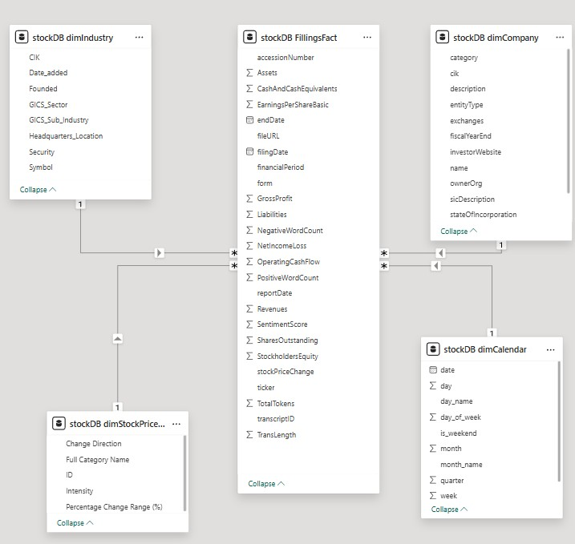
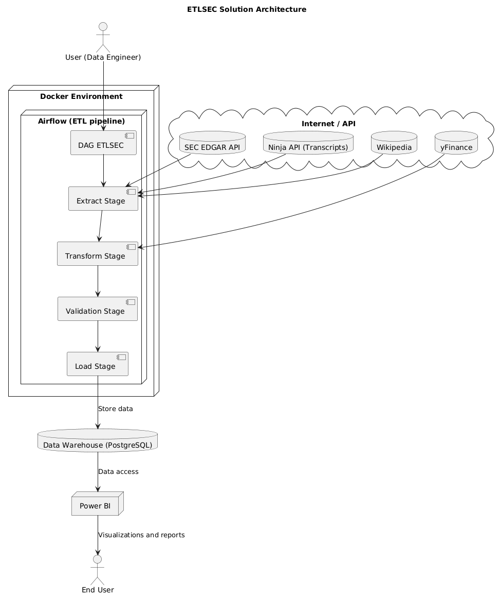

# 📊 ETLsec – ETL Pipeline for Financial Data from SEC EDGAR

**ETLsec** is a containerized ETL (Extract-Transform-Load) pipeline designed to collect, clean, and analyze financial data from the SEC EDGAR API, earnings transcripts from Ninja API, and stock data from yFinance. The entire workflow is orchestrated with Apache Airflow and runs inside a Docker environment.

---

## 🧠 Project Overview

The pipeline automates the following steps:

- **Extract**: Scrapes company financial reports using the SEC EDGAR API, retrieves earnings call transcripts from Ninja API (2024+), and fetches stock prices from yFinance.
- **Transform**: Processes raw facts, calculates quarterly stock returns, joins transcript sentiment data, and reshapes tables into a fact schema.
- **Validate**: Identifies missing key metrics based on inconsistent GAAP mappings and logs validation results.
- **Load**: Stores the final enriched dataset into a PostgreSQL warehouse or flat files (CSV).
- **Vizualize**: Loads data to Power Bi report.

---

## 🧱 Architecture

The solution is built using:

- 🐳 **Docker** for reproducibility and isolated environments
- ⏳ **Apache Airflow** to orchestrate ETL steps and DAG scheduling
- 🐍 **Python** for web scraping, transformation, and validation
- 🐘 **PostgreSQL / CSV** as the target data warehouse

 <div style="display:flex; gap: 20px; align-items: flex-start;">   </div> 

---

## 📄 Power BI Report

You can view the Power BI PDF report by clicking the link below:

👉 [Power BI Report (PDF)](https://drive.google.com/file/d/1MEFvd2lzXrZ3alYl3vmi_Pxshr6wZ3l9/view?usp=sharing)

---

## 📦 Technologies Used

| Layer      | Tool/Library              |
|------------|---------------------------|
| Orchestration | Apache Airflow         |
| Environment   | Docker, Docker Compose |
| Data Sources  | SEC EDGAR API, Ninja API, yFinance |
| Sentiment Analysis  | ProsusAI/finBERT |
| Storage       | PostgreSQL / CSV       |
| Transformation | Pandas, yFinance, finBert Sentiment |
| Validation     | Custom GAAP metric mapping |

---

## 🚀 Quick Start

### 1. Clone the Repository

```bash
git clone https://github.com/prosowiec/ETLsec.git
cd ETLsec
```

## 🚀 Build and Start the Environment

To build the custom Airflow image and start the ETL environment, run the following commands:

```bash
docker build -t custom-airflow:3.0.1 .
docker-compose up -d
```

## 🧠 Credits

Developed by **prosowiec** as part of a **Business Intelligence course project**.